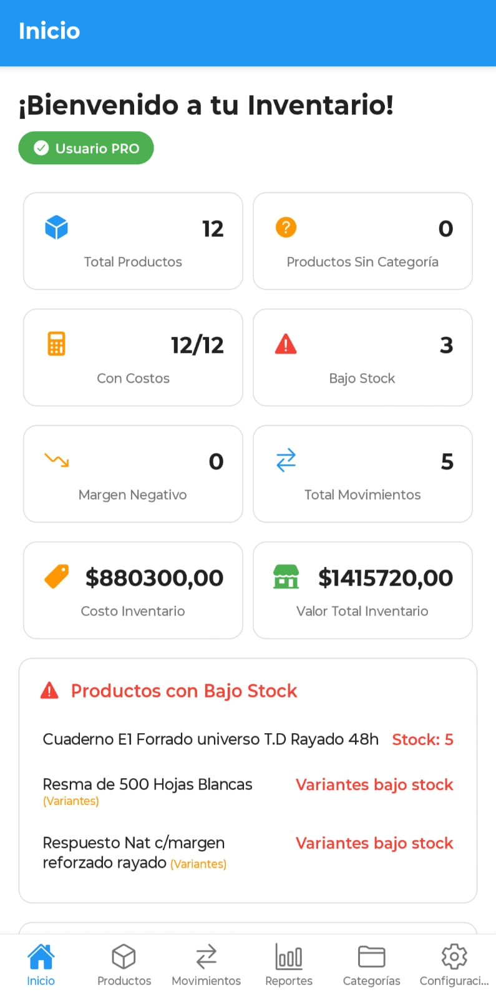

# 🚀 Setup Rápido - 5 Minutos

## 1. Reemplazar Información de Contacto

En `index.html`, buscar y cambiar:
- `soporte@inventarioapp.com` → TU_EMAIL
- Enlaces de redes sociales (líneas 520-535)
- Enlace de Google Play (línea 82)

## 2. Imágenes Temporales (Funciona Inmediatamente)

Reemplaza estas líneas en `index.html`:

```html
<!-- Línea 103: Screenshot de la app -->

<!-- CAMBIAR POR: -->


<!-- Líneas 245-247: Avatares -->

  

<!-- CAMBIAR POR: -->


```

## 3. Probar Inmediatamente

```bash
cd C:\InventarioAppWeb
start index.html
```

¡Listo! Tu sitio funciona perfectamente con imágenes temporales.